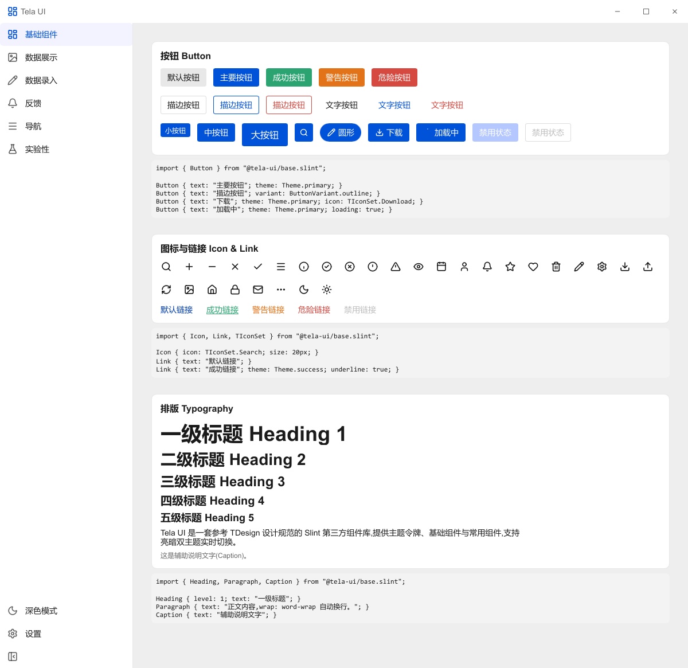
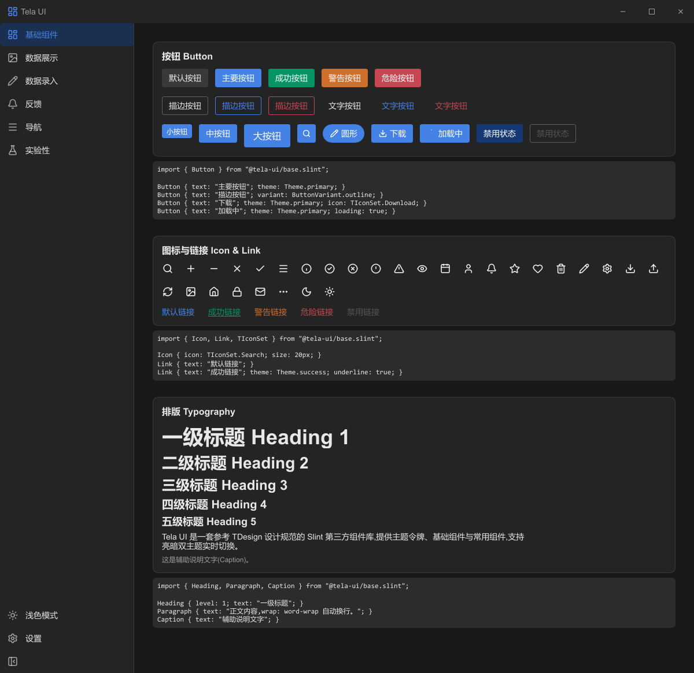

# Tela UI

TDesign-inspired component library for [Slint](https://slint.dev) — theme
tokens, basic components and common components with live light/dark theming.




## Features

- **主题配置 Theme** — full TDesign token set (brand/success/warning/error
  ramps ×10, 14-step gray, text/background/border/mask colors, spacing system,
  radii, type scale, shadows) exposed as a customizable struct config with
  light & dark presets and live switching. `TelaTheme.is-dark` exposes the
  mode actually in effect (`system` resolved against the OS scheme).
- **基础组件 Basic** — Button, Link, Icon (39 built-in Lucide glyphs),
  Heading / Paragraph / Caption, Divider, Tag, Loading, BorderlessWindow
  (frameless window with themed custom title bar).
- **常用组件 Common** — Input, TextArea, Select, CheckBox, Radio /
  RadioGroup, Switch, Slider, Progress (line & circle), Avatar, Badge, Card,
  Alert, Dialog, Drawer, Message (global toast with 6-way placement), Tabs,
  Pagination, NavBar, SideNav (collapsible, with bottom footer entries and a
  TDesign-style fold toggle), Breadcrumb, Steps,
  CodeBlock (themed code panel), Drawer (top/right/bottom/left placements).

## Project layout

```
tela-ui/                 ← the component library (registered as import name "tela-ui")
  theme.slint            ← TelaTheme global: light/dark presets + forwarded tokens
  colors.slint           ← TLightColors / TDarkColors palettes
  structs/theme.slint    ← TPrimaryColor / TAppThemeConfig structs
  structs/enums.slint    ← shared semantic enums (Theme, Size)
  base.slint             ← aggregate re-exports: 基础组件
  base/                  ← button, link, typography, divider, tag, loading,
                           borderless-window
    icon/                ← icon data split lucide-slint style:
      data.slint           structs (TIconPath/TIconData) + TIconSet path data
      icon.slint           shared `Icon` renderer (data-driven, lucide-slint style)
  common.slint           ← aggregate re-exports: 常用组件
  common/                ← input, select, checkbox, radio, switch, slider,
                           progress, avatar, badge, card, alert, dialog,
                           drawer, message, tabs, pagination, nav, side-nav,
                           breadcrumb, steps, code-block
  experimental.slint     ← aggregate re-exports: 实验性组件 (APIs may change)
  experimental/          ← skeleton, …
ui/MainWindow.slint      ← gallery shell: brand header + collapsible SideNav
                           switch pages; window-level Dialog / Drawer /
                           MessageOverlay
ui/pages/                ← one file per page (basics, data-display,
                           form-section, feedback, navigation,
                           experimental, settings) — every live example is
                           paired with a themed CodeBlock from the library
src/                     ← Rust host (reads TELA_THEME=light|dark env var)
```

## Getting started

Register the library path in your `build.rs`, then import components with the
`@tela-ui/` prefix:

```rust
use std::{collections::HashMap, path::PathBuf};

fn main() {
    let library_paths = HashMap::from([(
        "tela-ui".to_string(),
        PathBuf::from("path/to/tela-ui"), // the tela-ui/ folder of this project
    )]);
    let config = slint_build::CompilerConfiguration::new()
        .with_library_paths(library_paths);
    slint_build::compile_with_config("ui/MainWindow.slint", config).unwrap();
}
```

```slint
import { TelaTheme } from "@tela-ui/theme.slint";
// Category aggregates — or import from "@tela-ui/base/button.slint" etc. directly
import { Button, Icon, Tag } from "@tela-ui/base.slint";
import { Input, Select, Card, TelaMessage, MessageOverlay } from "@tela-ui/common.slint";
import { Skeleton } from "@tela-ui/experimental.slint";

export component MainWindow inherits Window {
    background: TelaTheme.bg-color-page;

    Button {
        theme: 1;              // 0 default, 1 primary, 2 success, 3 warning, 4 danger
        variant: 1;            // 0 base, 1 outline, 2 text
        text: "主要按钮";
    }
}
```

> Inside the library (`tela-ui/` folder) all imports are plain relative paths
> (`from "../theme.slint"`, `from "base/button.slint"`). Only consumers of the
> library use the `@tela-ui/` prefix, which resolves through the library path
> registered in `build.rs`.

Run the gallery demo (pages are switched by the collapsible SideNav —
基础组件 / 数据展示 / 数据录入 / 反馈 / 导航 / 实验性 / 设置 — and every
live example is paired with a code block):

```sh
cargo run                     # follow OS color scheme
TELA_THEME=dark cargo run     # force dark
```

## Theming

All tokens live in the `TelaTheme` global (`theme.slint`). The active config
is a `TAppThemeConfig` struct; `light` / `dark` are two `in-out` presets.

```slint
// Read tokens
Rectangle { background: TelaTheme.bg-color-container; }

// Patch a single token of a preset
TelaTheme.dark.bg-page = #101010;

// Replace a whole preset (any omitted field must be provided — build on
// TLightColors / TDarkColors to keep the original ramps)
import { TDarkColors } from "@tela-ui/colors.slint";
TelaTheme.dark = {
    animation-duration: 200ms,
    duration-fast: 150ms,
    duration-slow: 300ms,
    primary: TDarkColors.brand,
    // …full field list, see structs/theme.slint
};
```

```rust
// From Rust (TelaTheme/TelaThemePreference are re-exported by ui/MainWindow.slint)
use tela_lib::{TelaTheme, TelaThemePreference};
TelaTheme::get(&ui).set_preference(TelaThemePreference::Dark);
```

`preference` defaults to `system` and follows `Palette.color-scheme` live;
components restyle automatically through their `states`. Bind mode toggles to
`TelaTheme.is-dark` (not `preference`) so they reflect the resolved mode.

```slint
Switch {
    checked: TelaTheme.is-dark;      // true when the OS is dark and preference is system
    changed(c) => { TelaTheme.preference = c ? TelaThemePreference.dark : TelaThemePreference.light; }
}
```

## Component quick reference

| Component   | Key properties                                                                 |
| ----------- | ------------------------------------------------------------------------------ |
| Button      | `theme` `variant` `size` `shape` `block` `icon: TIconSet.X` `loading` `disabled` `clicked()` |
| Link        | `theme` `underline` `icon: TIconSet.X` `disabled` `clicked()`                   |
| Icon        | `icon: TIconSet.X` `size` `icon-color` (all entries in `base/icon/data.slint`)  |
| Heading     | `level` 1..5                                                                    |
| Divider     | `orientation` `text` `align: DividerAlign` (left/center/right)                   |
| Tag         | `theme` `variant: TagVariant` (dark/light/outline) `size` `closable` `closed()` `clicked()` |
| Input       | `text` `placeholder-text` `prefix-icon: TIconSet.X` `suffix-icon` `clearable` `status` `size` |
| TextArea    | `text` `rows` `status`                                                           |
| Select      | `items: [SelectItem]` `current-index` `current-value` `selected(i, value)`       |
| CheckBox    | `checked` `indeterminate` `text` `changed(bool)`                                 |
| RadioGroup  | `items: [RadioItem]` `value` `changed(string)`                                   |
| Switch      | `checked` `size` `changed(bool)`                                                 |
| Slider      | `minimum` `maximum` `step` `value` `changed(f)` `released(f)` (arrow keys)       |
| Progress    | `variant` (0 line / 1 circle) `value: 0..100` `theme` `size`                     |
| Loading     | `text` `theme` `size`                                                            |
| Avatar      | `text` `source` `shape: AvatarShape` (circle/square) `size: AvatarSize` `theme`  |
| Badge       | wraps children; `count` `dot` `max-count` `badge-color`                           |
| Card        | wraps children; `title` `subtitle` `footer` `bordered` `shadowed`                 |
| Alert       | `theme` `title` `description` `closable` `open` `closed()`                        |
| Dialog      | place in an overlay; `open` `title` `content` `accepted()` `canceled()`           |
| Drawer      | place in an overlay; `open` `title` `placement: DrawerPlacement` (top/right/bottom/left) `drawer-width` `drawer-height` `closed()` |
| Message     | `TelaMessage.info/success/warning/error(text)` + one `MessageOverlay` in window; `TelaMessage.placement`: 6-way `MessagePlacement`, default top-center |
| Tabs        | `items: [string]` `current-index` `changed(int)`                                  |
| Pagination  | `total-pages` `current` `changed(int)`                                            |
| NavBar      | `title` `logo` `items: [NavItem]` `current-value` `changed(string)`; children form the trailing action slot |
| SideNav     | `title` `logo` `items: [SideNavItem]` `current-value` `collapsed` `mode: SideNavMode` `toggle-position` `footer-items: [SideNavFooterItem]` `changed(string)` `footer-clicked(item)` |
| Breadcrumb  | `items: [CrumbItem]` `current-value` `separator` `changed(string)`                 |
| Steps       | `items: [string]` `current` (earlier steps render as done)                         |

## Credits & notes

- Icon geometry from [Lucide](https://lucide.dev) (ISC license), packaged with
  the data-driven structure of
  [lucide-slint](https://github.com/cnlancehu/lucide-slint) (MIT OR Apache-2.0).
- Design tokens follow the TDesign specification
  (https://tdesign.tencent.com).
- Known limitations: no dashed button variant (Slint borders are solid only),
  Select has no keyboard navigation yet, TextArea has no maxLength counter.

## License

Copyright 2026 DragonheartLX. Licensed under the
[Apache-2.0](LICENSE) license.

Note: this covers the tela-ui sources only. Applications built with Slint are
additionally subject to Slint's own licensing (GPL-3.0 or the royalty-free
Slint license).
