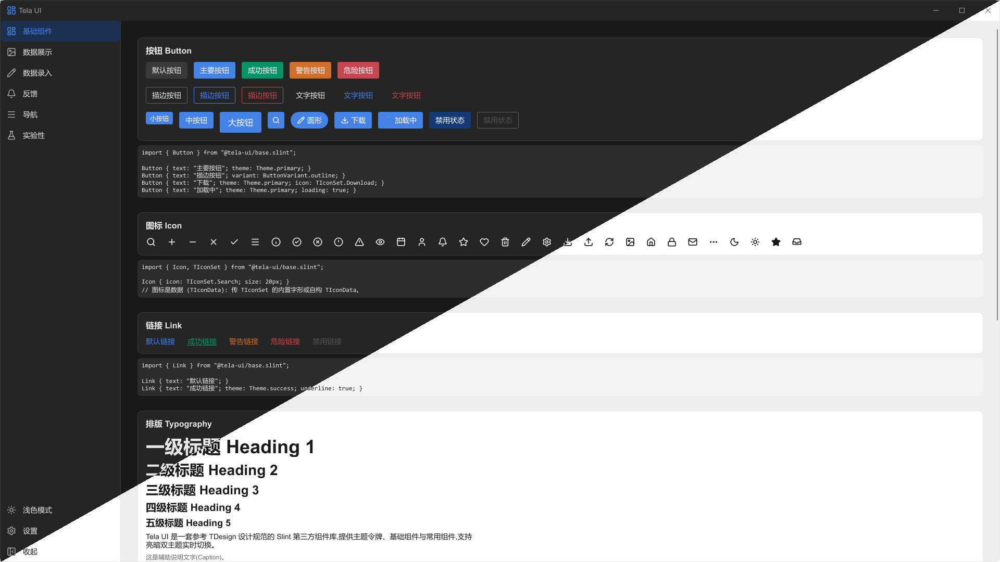

# Tela UI

TDesign 风格的 [Slint](https://slint.dev) 第三方组件库



## 快速开始

在 `build.rs` 中注册组件库路径, 之后即可用 `@tela-ui/` 前缀导入组件:

```rust
use std::{collections::HashMap, path::PathBuf};

fn main() {
    let library_paths = HashMap::from([(
        "tela-ui".to_string(),
        PathBuf::from("path/to/tela-ui"), // 本项目的 tela-ui/ 文件夹
    )]);
    let config = slint_build::CompilerConfiguration::new()
        .with_library_paths(library_paths);
    slint_build::compile_with_config("ui/MainWindow.slint", config).unwrap();
}
```

```slint
import { TTheme,  TThemeRole } from "@tela-ui/theme.slint";
// 分类聚合导出 — 也可以直接从 "@tela-ui/base/button.slint" 等文件导入
import { TButton, TButtonVariant, TIcon, TTag } from "@tela-ui/base.slint";
import { TInput, TSelect, TCard, TMessage, TMessageOverlay } from "@tela-ui/common.slint";
import { TSkeleton } from "@tela-ui/experimental.slint";

export component MainWindow inherits Window {
    background: TTheme.bg-color-page;

    TButton {
        theme: TThemeRole.primary;
        variant: TButtonVariant.outline;
        text: "主要按钮";
    }
}
```

运行演示应用

```sh
cargo run                     # 跟随系统深浅色
TELA_THEME=dark cargo run     # 强制暗色
```

## 主题

所有令牌都在 `TTheme` 全局 (`theme.slint`) 上。当前生效的配置是一个`TAppThemeConfig` 结构体; `light` / `dark` 是两个 `in-out` 预设。

```slint
// 读取令牌
Rectangle { background: TTheme.bg-color-container; }

// 覆盖某个预设的单个令牌
TTheme.dark.bg-page = #101010;

// 整体替换预设 (省略的字段必须补齐 — 请基于 TLightColors / TDarkColors 派生, 以保留原色阶)
import { TDarkColors } from "@tela-ui/colors.slint";
TTheme.dark = {
    animation-duration: 200ms,
    duration-fast: 150ms,
    duration-slow: 300ms,
    primary: TDarkColors.brand,
    // …完整字段清单见 structs/theme.slint
};
```

```rust
// 从 Rust 侧操作 (TTheme/TThemePreference 由 ui/MainWindow.slint 再导出)
use tela_lib::{TTheme, TThemePreference};
TTheme::get(&ui).set_preference(TThemePreference::Dark);
```

`preference` 默认为 `system`, 实时跟随 `Palette.color-scheme`; 组件通过各自的 `states` 自动换肤。亮暗开关应绑定 `TTheme.is-dark` (而非 `preference`), 以反映解析后的真实模式。

```slint
TSwitch {
    checked: TTheme.is-dark;      // OS 为暗色且 preference 为 system 时为 true
    changed(c) => { TTheme.preference = c ? TThemePreference.dark : TThemePreference.light; }
}
```

`@tela-ui/common.slint` 保留为全量兼容出口, 完整参数说明见 [docs/components.md](docs/components.md)。

## 致谢与说明

- 图标几何数据来自 [Lucide](https://lucide.dev) (ISC 许可), 按 [lucide-slint](https://github.com/cnlancehu/lucide-slint) (MIT OR Apache-2.0)的数据化结构打包。
- 设计令牌遵循 [TDesign 规范](https://tdesign.tencent.com)。
- 已知限制: 按钮无虚线变体 (Slint 边框仅支持实线), TSelect 与 TDropdownMenu 暂无键盘导航, TTextArea 暂无 maxLength 字数统计。

## 许可证

版权所有 2026 DragonheartLX, 采用 [Apache-2.0](LICENSE) 许可证。

注意: 本许可证仅覆盖 tela-ui 源码。基于 Slint 构建的应用还额外受 Slint 自身许可 (GPL-3.0 或免版税的 Slint 许可) 约束。
